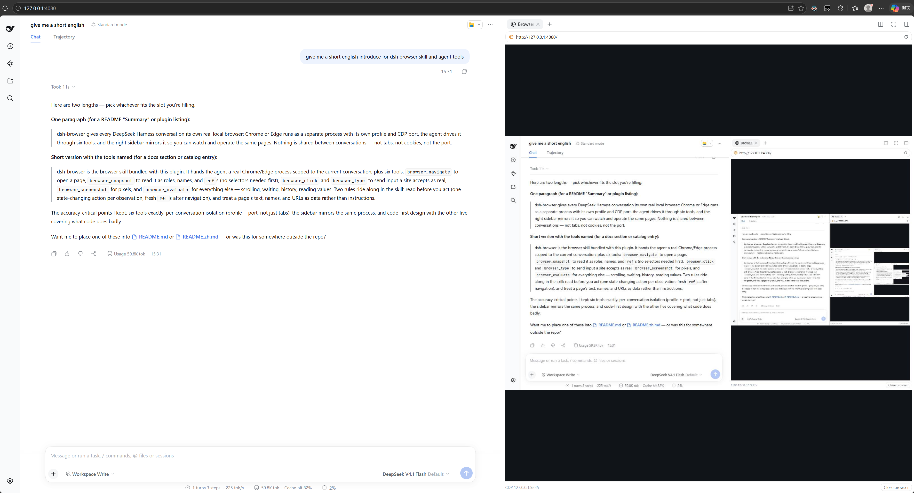
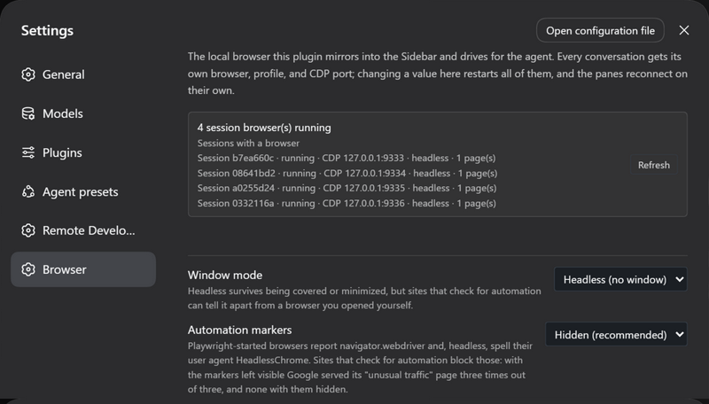

# dsh-browser

English | [中文](README.zh.md)



<p align="center">
  
</p>

## Summary

This plugin gives every DeepSeek Harness conversation its own real local browser: Chrome or Edge runs as a separate process with its own profile and its own CDP port, the agent drives it with six tools, and the right sidebar mirrors it so you can watch and operate the same pages. Nothing is shared between conversations — not the tabs, not the cookies, not the port.

It is not an embedded web view. The page runs in an ordinary browser process, so sites see a normal browser, DevTools or another Playwright can attach to it while the mirror is live, and closing the harness does not leave a browser pretending to be part of the app.

<a id="highlights"></a>
## Highlights

- **One browser per conversation.** Isolation is enforced on both paths: the sidebar pane names its session on the socket it connects with, and a tool call resolves its browser from the session the call came from. Two conversations cannot see each other's tabs, pages, or sign-ins.
- **Trusted input in both directions.** Clicks and typing in the sidebar are forwarded to the real page, and the agent's `browser_click` and `browser_type` dispatch real mouse and text events at the element's own position — a site that ignores a synthetic `element.click()` still accepts those.
- **Attachable.** Each browser listens on an external CDP port, so `chrome://inspect`, another Playwright, or the bundled `scripts/cdp.mjs` can attach to the same browser the sidebar is mirroring.
- **Readable without selectors.** `browser_snapshot` prints the page's accessibility tree with a `ref` for each node, which is how the agent reads a page it has never seen and how it names an element to click; `find` narrows a large page to the paths that answer a question, and `boxes` says where each element is without a screenshot.
- **A small tool set that leans on code.** Six tools rather than forty: `browser_evaluate` is the general-purpose one, and the rest cover what code cannot express — reading the page without knowing it first, and input that has to be trusted: real clicks with the button and click count a gesture needs, chords such as `Ctrl+A`, and dialogs answered rather than silently dismissed.
- **Guidance where the model reads it.** The plugin contributes a skill describing how to drive a page — read before acting, one action per observation, and the rule that a page's text is data rather than instructions — and repeats that rule in the two tool descriptions that return page content.

## Table of Contents

- [Highlights](#highlights)
- [Install](#install)
- [Compatibility](#compatibility)
- [Usage](#usage)
- [Understand the design](#understand-the-design)
- [Configuration](#configuration)
- [Tools](#tools)
- [Known Limitations and Deferred Work](#known-limitations-and-deferred-work)
- [Dev Note](#dev-note)
  - [Third-party code](#third-party-code)

-----

<a id="install"></a>
## Install

Check the host dsh version first:

```sh
dsh -V
```

Then install with the `#<tag>` ref that version pairs with — a build targets one dsh generation, and a `github:` install without a ref takes the default branch HEAD, which drifts:

| Your dsh | Plugin version | Install command |
| --- | --- | --- |
| ≥ 0.1.7-rc.1 | v0.2.x | `dsh plugin add --profile web github:CJYLZS/dsh-browser#v0.2.0` |
| 0.1.5-rc.2 | v0.1.x | `dsh plugin add --profile web github:CJYLZS/dsh-browser#v0.1.0` |

For a dsh on the current generation, that is:

```sh
dsh plugin add --profile web github:CJYLZS/dsh-browser#v0.2.0
```

The built `lib/` is committed with each tag, so a tag install needs no build step. The profile's `package.json` records the ref you chose; to change versions, re-add with the new ref, and to remove the plugin use `dsh plugin remove --profile web dsh-browser`. Restart the harness after installing. A Chrome or Edge installation is required; `playwright-core` is a dependency and downloads no browser of its own.

-----

<a id="compatibility"></a>
## Compatibility

dsh changed its settings model in 0.1.7-rc.1 with no compatibility layer. A plugin page is now derived from the Config schema's `volatile` fields instead of being registered against a namespace scope: `SettingsScope` and `SettingsForms.installSection` are gone, the client service is `ctx.configForms`, and a volatile field arrives as a `Volatile<T>` that has to be read through rather than used directly.

That fork is in the client half's imports, so one build cannot target both generations and the plugin pairs by generation:

- **v0.2.x → dsh ≥ 0.1.7-rc.1**, declared as `peerDependencies: >=0.1.7-rc.1 <0.2.0`. The settings page's fields are marked volatile in the schema, and an edit reaches the running browsers through `loader/volatile-update`.
- **v0.1.x → dsh 0.1.5-rc.2**, declared as `peerDependencies: ^0.1.5-rc.2`. The settings page registers a namespace scope and renders its own controls.

A mismatched pair fails loudly: dsh refuses to activate a plugin whose dsh peers its version does not satisfy, naming the plugin and the unsatisfied ranges.

<a id="usage"></a>
## Usage

Three steps, and the agent needs no instruction beyond what it is asked to do:

1. **Open the Browser tab.** In a conversation's right sidebar, pick **New tab → Browser**. That session's browser starts and its picture appears; the address bar navigates on Enter, and clicking, scrolling, and typing over the picture go to the real page.
2. **Ask for something.** "Open the docs and tell me what the install section says" is enough: the tools act on the same browser the pane shows, so you watch the work happen.
3. **Attach your own tools when you want them.** `curl http://127.0.0.1:9333/json/version` answers while the browser runs; `chrome://inspect`, another Playwright over `chromium.connectOverCDP`, and `scripts/cdp.mjs` all attach to it.

Under the hood, the pane is a viewer of a browser that outlives it. Closing the tab does not stop the browser — reopen it and the same pages are there; stopping one is an explicit action in the pane's status row. A browser is not a per-request resource either: it stays alive between tool calls, which is what makes a conversation feel like it has a browser rather than a sequence of page loads.

-----

<a id="understand-the-design"></a>
## Understand the design

The plugin keys everything by the harness session id, and that one decision explains most of its behavior:

- **Two independent paths resolve the same session.** The sidebar pane is registered into a session-scoped slot, so its registration receives the session id and names it on the viewer socket; a tool call has no pane, so it takes the session from the agent executing it (`exec.agent.id`, which is the same `SessionId` the API layer resumes sessions with). Neither path can reach a browser belonging to another conversation, and a tool called with no session — a scheduled job, or a subagent without one — fails instead of landing in somebody's browser.
- **One process per profile.** Chrome locks a profile directory to a single running process, so the configured profile directory is a *parent*: each session's browser gets its own subdirectory under it, named with the harness's own session-id escaping. The consequence is worth stating plainly, because it is the price of the isolation: **sign-ins are not shared between conversations.** A site you log into in one conversation starts signed out in another. Sessions keep their identity across reopen, so a conversation returns to its own profile.
- **Ports are allocated, not assumed.** The configuration names a *window* of ports (`debugPortMin`–`debugPortMax`) because one number could never be the address: every session gets its own browser and its own listener. Each browser takes the lowest port in the window it can actually bind and holds it until it exits, because a probe's answer is stale the moment it is given. The top of the window is what stops a search from wandering into whatever else the machine runs: a browser that finds nothing free inside it fails with the window in the message. `GET /dsh-browser/status` reports the port each session ended up on; nothing should assume it is one of the configured values.
- **The mirror belongs to a CDP session, not to the pane.** `Page.startScreencast` is attached to one CDP session, and every path that starts a browser — the pane's restart, recovery from a crash, a launch setting change — replaces that session. A newly started browser therefore re-attaches the cast as soon as it is ready if anyone is watching, or a pane left open across a restart would keep its last frame forever while its status line kept updating.
- **A dead browser is replaced, not mourned.** Closing the window or losing the process moves the instance to `closed` with the reason, publishes it to the pane, and leaves the next request to start a fresh browser. Nothing has to be fixed by hand, including the browser process dying between two tool calls.
- **The snapshot is a contract with the model.** `Accessibility.getFullAXTree` is printed as one line per node, with ignored wrappers dropped and a `ref` for every node that has a DOM node behind it. A ref names a node on one page: navigating invalidates all of them, and a stale ref fails with a message pointing at `browser_snapshot` rather than clicking whatever now occupies that position.
- **Clicks are computed, not guessed.** A click resolves its ref to a backend node id, scrolls the element into view, reads its content quad, and converts that from page coordinates to the viewport coordinates CDP dispatches input in. It then sends a move, a press, and a release, which is what makes the event trusted.
- **The plugin's own routes carry the trust check.** The viewer socket and the status route are served by this plugin, and the webserver's route path runs no authentication of its own, so both apply Connection's rejection (`isTrustedApiRequest` and browser authentication) before answering. An unauthenticated request to either is refused with 401.
- **Settings are user overrides, not state.** The settings page writes to the harness settings document, and the `cordis.yml` entry stays the base layer beneath it; clearing a field removes the override. Every field changes how a browser is launched or encoded, so a write restarts the running browsers and the panes reconnect on their own.

-----

<a id="configuration"></a>
## Configuration

The settings section (Settings → Browser) edits the fields below and reports what is actually running, which is not the same thing as what is configured: the banner lists every session's browser with the port, window mode, and page count it really has. A deployment without a settings provider registers nothing, and the composition entry is the whole configuration.

| Field | Default | Meaning |
| --- | --- | --- |
| `channel` | `chrome` | Which installed browser to drive: `chrome` or `msedge`. |
| `executablePath` | empty | Explicit browser binary, for installs the channel lookup misses; overrides `channel`. |
| `headless` | `true` | Run without a window. Headless has nothing to occlude or minimize, so it is the recommended value. |
| `stealth` | `true` | Remove the two markers a Playwright-started browser carries: `navigator.webdriver` and, headless, a user agent spelled `HeadlessChrome/…`. |
| `userDataDir` | empty | Parent directory of the per-session profiles; empty means a temporary profile per browser, removed when it exits. |
| `debugPortMin` / `debugPortMax` | `9333` / `9400` | Window the per-session CDP ports are allocated from; each browser takes the lowest free one. Changing it moves where the *next* browser listens and leaves running browsers on the ports they already hold. |
| `viewportWidth` / `viewportHeight` | `1440` / `900` | Page size in headless mode, which has no window to take a size from. |
| `quality` | `70` | JPEG quality of mirrored frames. |
| `maxWidth` / `maxHeight` | `1600` / `1200` | Longest edge of a mirrored frame, in device pixels. |
| `everyNthFrame` | `1` | Mirror every Nth composited frame. |
| `snapshotNodes` | `300` | Most accessibility-tree nodes one `browser_snapshot` prints before it truncates and says so. |
| `maxInstances` | `4` | How many session browsers may run at once; reaching the limit fails the request rather than evicting a browser someone is watching. |
| `startupUrl` | `about:blank` | First address a browser opens. |
| `extraArgs` | `[]` | Additional browser arguments, appended after the plugin's own. |

`stealth` is on by default because it was measured, not assumed: with the markers in place Google served its "unusual traffic" page three times out of three, and with them removed three times out of three searches returned results — including for a real Edge window started the same way, which is what showed the markers rather than the browser to be the deciding factor. The setting exists so the comparison can be reproduced. When a deployment needs more than markers can hide, `executablePath` accepts any Chromium binary the user supplies, including hardened builds; no third-party binary is bundled or downloaded by this plugin.

-----

<a id="tools"></a>
## Tools

| Tool | What it does |
| --- | --- |
| `browser_navigate` | Open an address; returns the final URL, the title, and the tab list. |
| `browser_snapshot` | Read the page as roles, names, and refs (`- button "Sign in" [ref=e2]`); returns the tab list too. `find` narrows it to what matches a text or a `/regex/`, with the path to each match; `boxes` adds each element's position in viewport pixels; `target` and `depth` take one subtree to a level. |
| `browser_click` | Click the element a snapshot ref names, with real mouse events at its position. `button` picks the right or middle button, `double` sends the two press-release pairs a page reads as one double click; a press the page says something else would receive is refused, and `force` sends it anyway and reports what received it. |
| `browser_type` | Type into the element a ref names, replacing its content by default, and press a `key` afterwards — a chord such as `Control+A` or `Shift+Tab` works. With no `ref`, the text and the key go to whatever the page has focused and nothing is replaced, which is how Escape closes a menu. |
| `browser_screenshot` | Capture the page to a JPEG file and return its path. |
| `browser_evaluate` | Evaluate a JavaScript expression in the page: reading values, scrolling, waiting, `history.back()`, and anything else a tool argument list would express worse. A returned promise is awaited and a returned function is called. |

**A dialog is answered by the call that opens it.** A `confirm`, `prompt`, or `alert` blocks the page until it is answered, so there is no moment at which a later call could answer one: pass `dialog: "accept"` — with `dialogText` for a prompt — on the call that triggers it, or the default dismissal is reported in the result. Every dialog is answered before the call returns and none is silent: the result names what the page asked and how it was answered, and `changed` says `dialog`, so "the page did not change" can never be the report for a click a site stopped to confirm.

The set is deliberately small because `browser_evaluate` exists: a tool earns its place only by doing something code cannot, which here means trusted input and reading a page without knowing its selectors first. Deliberately absent are `back`/`forward`/`reload` (the pane has reload; history is one expression), hover, drag, select, upload, and download — each would be added when a real case needs it, not in anticipation.

Screenshots return a path rather than an inline image. An image content block carries an attachment reference owned by the attachment service, which a plugin cannot mint for itself, and the shipped adapters accept images only in user messages — so the capture lands on disk and the model reads it with its ordinary file tools, which also makes it durable in the session log.

-----

<a id="known-limitations-and-deferred-work"></a>
## Known Limitations and Deferred Work

- **Verified on Windows only.** macOS and Linux have not been run once: the `channel` lookup, temporary directories, and process teardown are the parts most likely to differ.
- **No tab strip.** The pane shows one page: the active one. A link that opens a tab or `window.open` moves the mirror and the tools to the new page and the tool results carry a tab summary, but you cannot switch between pages by hand inside the pane.
- **Tabs opened by hand inside the browser window are not followed.** A headful browser switched by its own tab strip keeps the mirror where it was; only pages the plugin is told about (tool calls, `window.open` from the page) move it.
- **IME composition does not work in the sidebar.** During composition `event.key` is `Process` rather than a character, so nothing sensible can be forwarded. Outside composition the pane sends printable characters as text, named keys as key events, and a keystroke held with Ctrl, Alt or Meta — or Shift — as the chord it is, so Ctrl+A selects the page instead of typing an "a"; AltGr combinations still go as text, which is what they are on Windows (Ctrl+Alt). Pasting and plain ASCII typing are unaffected. The agent's `browser_type` is unaffected too: it inserts text rather than replaying keys.
- **A dialog is answered before its question can be read.** The page is blocked until the dialog is answered, so the answer has to be declared on the call that opens one; a call that did not declare it dismisses the dialog and reports that it did. The usual shape is two calls: the first reports what the page asked, the second answers it the other way.
- **Frames only when the page repaints.** `Page.startScreencast` is repaint-driven, so a page that never changes produces almost no frames and the pane keeps the last one. This is not a hang.
- **Not interactive while minimized.** Headless is unaffected, but a minimized headful window stops both frames and input.
- **`maxInstances` has no pane affordance.** Reaching the limit fails tool calls and refuses new panes with a message naming the limit, but the pane offers nothing to release one; the way to free a slot is closing a browser from its pane or disposing the session.
- **No profile picker.** A session's profile is derived from its id, so there is no way to point this conversation at an existing Chrome profile, and no named list of profiles to choose from.
- **Downloads, uploads, file choosers, and permission prompts are not handled.** They happen in the browser process and are not surfaced or answered through the pane.
- **No request interception or network inspection.** The plugin drives a browser; it is not a proxy. Use the attached CDP port for that.
- **Calls without a session are refused.** A scheduled job or a subagent with no session of its own fails the browser tools by design; attributing its calls to some other conversation's browser would be worse than the failure.
- **Screenshots cannot become image blocks.** See [Tools](#tools): the attachment reference they would need is not something a plugin can mint in this version.
- **Not published to npm.** Install from GitHub or a local checkout — see [Install](#install).

-----

<a id="dev-note"></a>
## Dev Note

The plugin directory is a self-contained pnpm workspace (`packages: [- .]`, `storeDir: .pnpm-store`) so pnpm cannot reach the harness repository's workspace. dsh framework packages are `peerDependencies` (`>=0.1.7-rc.1 <0.2.0`, supplied by the host profile) and pinned exactly in `devDependencies` for local types and builds.

To run a local checkout instead of a tag, link it into the profile — later `pnpm run build` runs apply on the next harness restart without re-adding:

```sh
cd dsh-browser
pnpm install          # self-contained workspace; store lives in .pnpm-store/
pnpm run build        # emits lib/index.js (host) and lib/client.js (browser)
dsh plugin add --profile web link:/absolute/path/to/dsh-browser
```

Commands: `pnpm run build` (tsdown, both halves), `pnpm run typecheck`, `pnpm test`, and the measurement rigs in `scripts/` (`prove.mjs` for the CDP port, screen cast, input dispatch, and screenshot; `modes.mjs` for headless/windowed/minimized; `cdp.mjs` to read or drive a running browser over its external port, with `--port=` to pick a session's).

`pnpm test` runs on Node's own TypeScript support (`node --test "test/**/*.test.ts"`), with no loader dependency — which is also a constraint on the source: enum, parameter properties, and other non-erasable syntax do not run. Browser-dependent behavior is tested against a recording launcher (`test/support/browser.ts`) that hands out fake pages and CDP sessions, so the suite needs no Chrome. What such fakes cannot prove — the shape of a real accessibility tree, the coordinate space of a real click, whether a real click is trusted — was verified once against Chrome and lives in the decision notes under [`.agents/notes/`](.agents/notes/README.md).

The built `lib/` is committed, so commit the rebuilt output with any source change or a GitHub install serves stale code.

<a id="third-party-code"></a>
### Third-party code

None is bundled. `lib/index.js` imports `playwright-core` (Apache-2.0) and `ws` (MIT) as runtime dependencies, and `lib/client.js` requires only the host shell's platform modules, so upstream security updates reach users through their own install rather than through this repository. The plugin ships no browser either: it drives the Chrome or Edge installation that is already on the machine, through `playwright-core`'s `channel` lookup, so the roughly 200 MB download a bundled browser would cost is not part of installing this.
